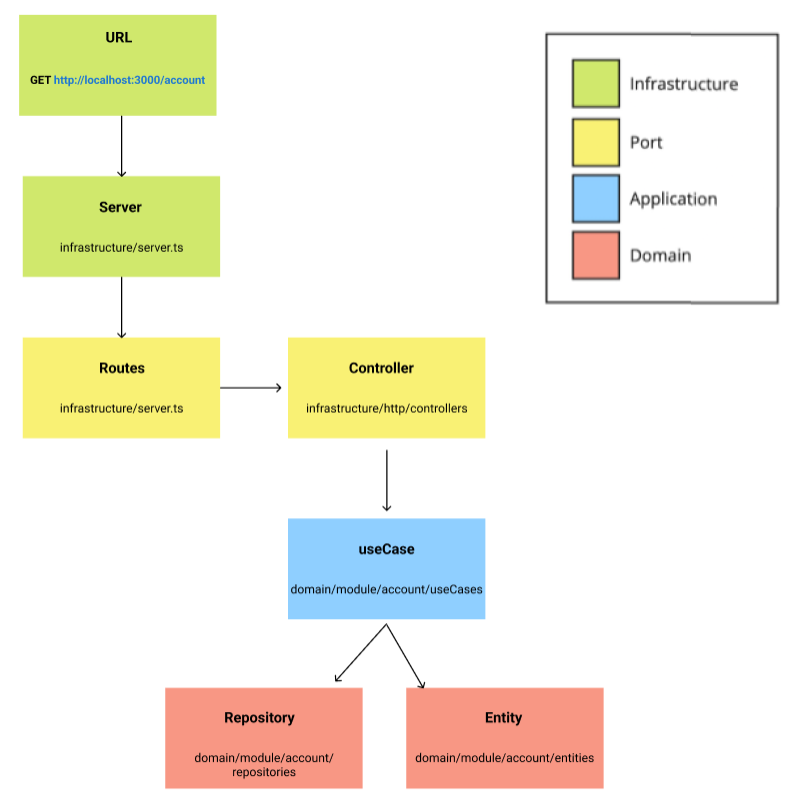

Hello there! this application has the conceptions of SOLID and clean architecture in this case I'm not using an extern database, all of the data is saved in memory, to show how the implementations of dependency inversion work, but nothing prevents the creation by keeping the interface contracts.

## Production dependency
* [Express](https://expressjs.com/pt-br/)
* [Mongoose](https://github.com/davidbanham/express-async-errors#readme)

## Installation and start project

```
yarn && yarn dev
or 
npm install && npm run dev
```

You should get
```
Server is running
```
Access http://localhost:8080/

## Testing

```
yarn test
or
npm test
```
### Routes

→ GET -> http://localhost:8080/account  | Lista todas contas.
→ GET -> http://localhost:8080/account/:id  | Lista uma conta.
→ POST -> http://localhost:8080/account | Cria uma conta.
→ DELETE -> http://localhost:8080/account/:id | Desativa uma conta.
→ PUT -> http://localhost:8080/account/:id | Atualiza uma conta.

## Clean Architecture


### Typical Request




